This is a self-made resume written while studying the material for the **HCNA-BCCP Huawei Certified Network Associate-Building Cloud Computing Platform**

The official material can be found [here][a7c749f4]

  [a7c749f4]: http://support.huawei.com/learning/trainFaceDetailAction?lang=en&pbiPath=term1000025174&courseId=Node1000007639 "link to Huawei web"

## Certification Main Objetives

- Describe the basic concept and values of Cloud Computing
- Be familiar with the features and concept of virtual technologies
- Be familiar with the basic structure of Huawei Cloud Computing solution
- Describe the hardware structure of FusionCloud
- Be familiar with the software structure of FusionCloud
- Master the configuration of Huawei Cloud Computing hardware
- Master the configuration of Huawei Cloud Computing software
- Master the configuration of Huawei Cloud Computing service

## Index

  - OHC11081 Cloud Computing Concepts and Values
  - OHC11082 Virtualization Technology
  - OHC11083 Huawei FusionCloud Solutions
  - OHC11084 Huawei Cloud Computing Hardware System
  - OHC11085 FusionCompute Architecture
  - OHC11086 FusionManager Architecture Principles
  - OHC11087 FusionAccess Architecture Principles
  - OHC11088 FusionCloud Solution Deployment

# 1 Cloud Computing Concepts and Values
----------------------------------------------

Key characteristics of cloud computing are On-demand self-service, Location-independent resource pool (ubiquitous network access over the Internet), Pay per use, Elasticity.

Cloud computing is a Computing/Storage Network. It includes devices for data processing (servers), data storage and data communications (switches); and services for virtualization, scheduling and management, and the providing platform.

Other characteristics are low-cost servers, distributed software and automatic management.

Cloud computing is an integration of grid computing, distributed computing, parallel computing, network storage technologies, virtualization, load balancing, and other
traditional computer and network technologies.

Deployment methods: private (organizations), public (telecom carrier), community (shared infraestructure) and hybrid cloud.

##### Bussiness models:
  - infraestructure as a Service (IaaS).Processors, storage devices, networks.
  - Platform as a Service (PaaS). Application development platforms such as Java and .Net.
  - Software as a Service (SaaS). Applications wich run on cloud computing infraestructure. Such as CRM, ERP and OA.

##### Other concepts:
  - Web 1.0 is the idea of users obtaining in*formation through web browsers.
  - Web 2.0 works the idea of let the users be creators and authors on the internet.

##### Key technologies:
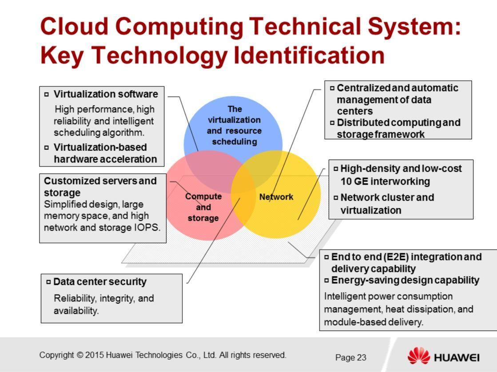

- Servers, large memory and high [IOPS](https://en.wikipedia.org/wiki/IOPS).
- Storage devices, high IOPS, linked cloning, thin provisioning and snapshot functions.
- Switches, high-density and low-cost.
- VMs, virtualization software platform for resource pools.
- Distributed computing, scheduling and adjustment.
- Data center security.
- Management software, integrated and automatic.

Can be classified into three aspects: architecture, hardware, and software.
Architecture:
- Scale up (vertical expansion): Adds storage capacity to existing systems.
- Scale out (horizontal expansion): Adds nodes. Each node can provide storage, proccessing, and I/O bandwith.

Storage system:
- The distributed storage system consolidates low-cost and SATA hard disks on servers into storage resource pools.

Data center Networking:
- The service data flow (VMs) trend changes from vertical traffic to horizontal traffic.
- Development of [layer 2](https://en.wikipedia.org/wiki/Data_link_layer) network.

##### Benefits of cloud computing
The virtualization supports scalability of servers:
- Each server is virtualized into multiple VMs.
- VM specifications (CPU and memory) can be flexibly changed to increase or reduce the numbers of VM.
- Physical memory resources can be virtualized into more virtual memory resources.
- The expansion of servers can be implemented using the PXE or an ISO file.
- Cloud-based service systems employ batch VM deployment.
- - Resources can be deployed in large scale in short time.
- Resources can be dynamically expanded and shrunk.
- Less manual operations due to the automatic deployment.
- Deployments times changes from a month to minutes.

##### Data centralization for information security
- Data is transferred through HTTPS.
- System access requires certificates or accounts.
- Secure architecture and [VMM](https://en.wikipedia.org/wiki/Virtual_Machine_Manager) to isolate VMs from each other. Automatic security management.
- Trend Micro antivirus software.

##### Smart scheduling for energy saving
- Intelligent scheduling policies.
- Dynamic power management (DPM).

##### Reduced noise and power consumption
##### Efficient maintenance for cost reduction
##### Seamless switchover and mobile office
You can log in to the system desktop using various terminals at any time. The data and desktops uniformly run and are stored on the data center. The [Hot Swap](https://en.wikipedia.org/wiki/Hot_swapping) mode is supported for terminal replacement.

##### In-service upgrade and expansion
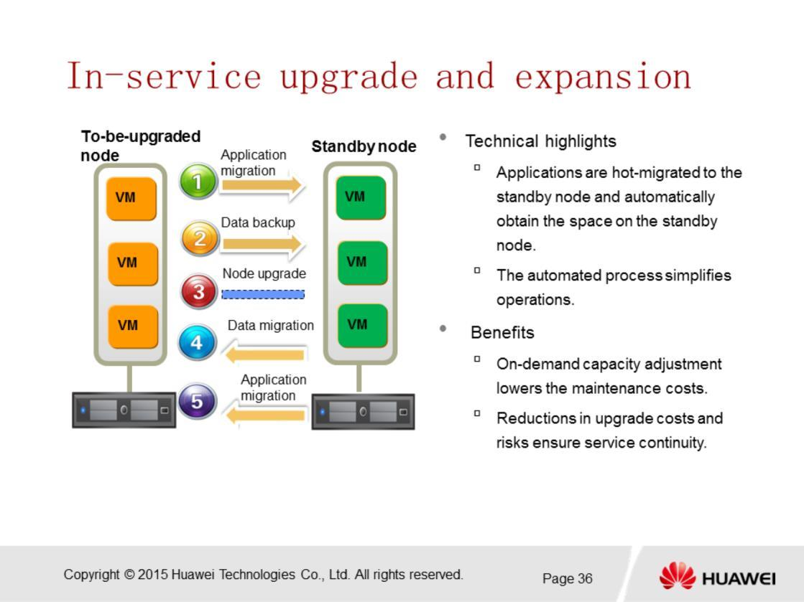

##### Unified management
Huawei cloud solutions supports:
- The ability to manage physical servers, switches, and Huawei firewall devices (E1000 and E8000) in a unified manner.
- Mainstream servers and storage devices from other vendors.
- Both, Huawei Virtualization software FusionCompute and VMware.

##### cloud computing Application and examples
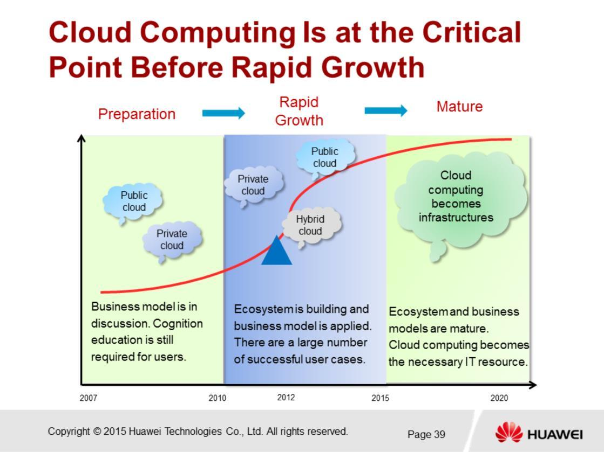

- Amazon EC2 supports VM leasing used in Linux and Windows, data processing, and storage leasing.
- Microsoft azure provides the VM development platform Visual Studio, which is based on Windows server and Linux systems.
- Alibaba cloud server, Elastic Compute Service (ECS).

##### Huawei Cloud Computing Solutions
Huawei FusionCloud solution is composed by four products:
  - FusionSphere. Cloud OS. Optimum cost effectiveness. Horizontal fusion.
  - FusionCube. Converged Appliance. Bussiness agility. Vertical Fusion.
  - FusionAccess. Desktop Cloud. Secure, efficient, user experience.
  - FusionInsight. Big data analysis. Easy-to-use, secure, reliable.

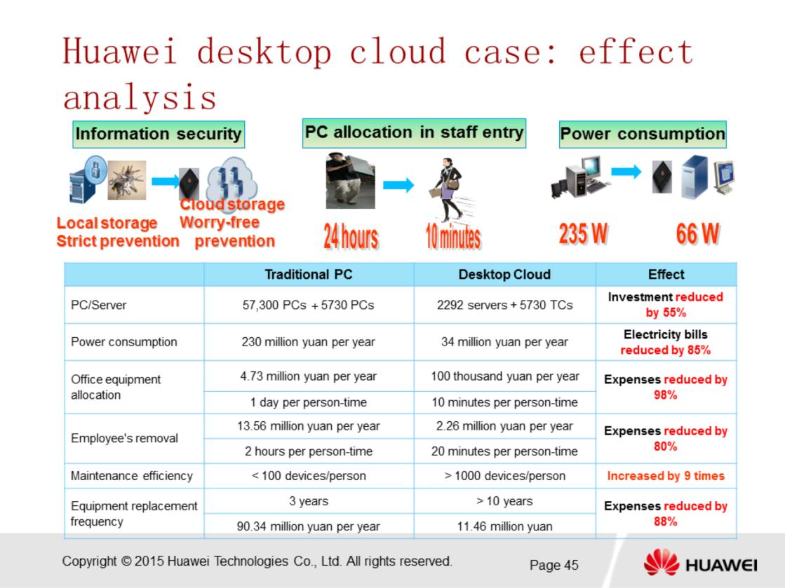

# 2 Virtualization technology
------------------------------------------------------
Virtualization converts "physical" resources into "logical" resources.
- Zoning. Multiple VMs can run on the same physical server.
- Isolation. VMs on the same server are isolated from each other.
- Encapsulation. Each VM is saved in a file. You can migrate and copy the file in order to migrate and copy the VM.
- Hardware-independence. VMs can run on any server without requiring any modifications on servers.

Concepts: Host machine(physical), guest machine (virtualized), Guest Os and Host OS, Hypervisor(VMM).

- Hosted virtualization: virtualization management software functions as a common application running on the underlying OS.
- Bare-metal virtualization: Hypervisor is a VM monitor that runs directly on physical hardware.
- OS-level virtualization: The host OS allocates hardware resources and separate virtual servers from each others.

Virtualization covers computing virtualization, storage virtualization, network virtualization.

#### Types of computing virtualization
- CPU virtualization: Multiple VMs share the same CPU. Sensitive instructions in VMs are intercepted, simulated and executed.
- Memory virtualization: Multiple VMs share the same physical memory and they need to be isolated from each other.
- I/O virtualization: Multiple VMs share the same physical device, such as a disk or a network adapter. Those I/O devices are multiplexed using time-division technology.

##### CPU virtualization
- VMs share the same CPU. Using timer interrupts, a mechanism similar to that used on raw OSs, instructions are trapped to the VMM upon triggering "interrupt" and are then scheduled based on the scheduling policy.
- Hypervisor get the instruction and put them into queue.
- An x86 processor has four priorities in protected mode, Ring 0 (for OS kernel), Ring 1 (OS Services), Ring 2 (OS services), and Ring 3 (applications).
- The typical virtualization approaches are privilege deprivileging and trap-and-emulation. Guest OSs run at a non-privileged level (deprivileging) whereas the VMM runs at the highest privilege level (full control of system resources).

##### Memory virtualization

The key point of memory virtualization lies in introducing a new layer of address space, that is, the physical address space of clients. Clients think that they run in the actual
physical address space; however, they access physical addresses through the VMM in fact.
The VMM saves the mapping table that records relationships between clients' address spaces and physical machines' address spaces.

##### I/O virtualization
The VMM intercepts the client OSs'access requests on devices and uses software to simulate itself as the actual device.

The front-end driver (blkfront) forwards data to the back-end driver (blkback) through the interfaces provided by the VMM.
Using the back-end driver, VMs'data is processed in a time-division multi-channel manner.

Discover a device:
- The device information about all VMs is saved on the XenStore of Domain0.
- The XenBus (a paravirtualization driver for Xen) on VMs communicates with the XenStore of Domain0 to obtainc device information.
- The front-end driver for the device is loaded.

Intercept device data:
- The front-end device forwards data completely to the back-end driver through the interfaces provided by the VMM.
- The back-end driver processes VM data on a time and channel basis.

#### Storage virtualization
Definition:
- Logical layer storage from physical storage devices.
- Admins adjust resources.
- Centralization of storage devices.

##### Raw Device + Logical Volume
- Storage devices (SAN or local disks) are mounted on hosts. Is the most direct control method. Raw devices are divided into blocks of 1Gb.
- Simple I/O paths and highest read & write peformance.
- No support for advanced services.

##### Storage Device Virtualization.
- Advanced storage functions such as thin provisioning, snapshot, and linked clone.
- Only for Huawei Advanced SAN and FusionStorage.

##### Host storage virtualization + File System
- Allows hosts to manage VM disk files through file system.
- Support for heterogeneous storeage devices and servers.
- Rich advanced functions, independent of hardware devices.
- Performance loss due to long I/O paths.

#### Network Virtualization

* A server can be virtualized into many hosts, meeting the inter-VM communication requirements.
* Dynamic migration of VMs.

##### Large Layer 2 Network and Technology
* Fiber Channel over Ethernet (FCoE) maps fiber channels (FCs) to Ethernet and inserts FC information to to Ethernet packets. Dedicated FCs are not necessary.
* FCoE transmit over the same cable LAN and FC SAN data.
* I/O integration maximizes return of investment (ROI).
* Data Center Bridging (DCB) build a losless Ethernet network.
* Both Ethernet and the FCoE protocol can run properly over Ethernet networks.

* SPB: Shosrtest Path Bridging
* TRILL: Transparent Interconnection of Lots of Links

Feature | SPB   | TRILL
--      |---    |--
Camp    |  Huawei, Avaya, HP, Ericsson and AL | Cisco, Huawei, Brocade, HP, IBM  
VM live migration  | supported  |  Supported
Multi-tenant      | 16 million  (24bit) | 4000 (12bit)
Convergence Speed  | Slow  | Fast
Compatibility  | Not supported   | Supported  (with existing switches)

##### Virtual switching
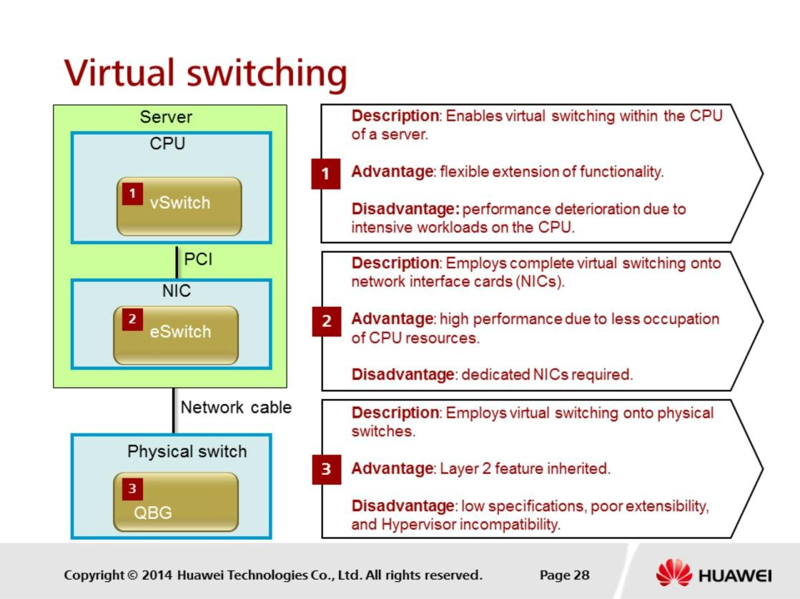
* vSwitch (virtual switch) implements Layer 2 Ethernet switching
functions on servers **CPUs**, including VM switching, QoS control, and security isolation.
* eSwitch (embedded switch) implements Layer 2 Ethernet switching
functions on servers **network** adapters, including VM switching, QoS control, and security
isolation.

##### Huawei's network virtualization solution
* Implements a central management for distributed virtual switching using vSwitches or eSwitches.
* Supports large Layer 2 solutions provided by network devices.

#### VMs
* A VM has a built-in OS, which is specified by the administrator when delivering the instructions for creating VMs.
* I is also possible to use a ISO file to install an OS.

Example of the process:
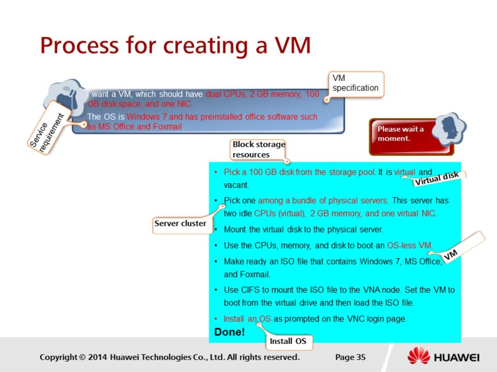

# 3 Huawei FusionCloud Solutions
-------------------------------------------------
FusionCloud is the general brandname for Huawei cloud computing solution. It includes **FusionSphere** cloud operating system(OS), **FusionCube** converged appliance, **FusionAccess** desktop cloud and **FusionInsight** big data analysis.

### Huawei FusionSphere Solution
It includes the following modules:
* UltraVR: manages remote disaster recovery (DR).
* HyperDP: manages the backup implementing VM-level backup management.
* FusionCompute: virtualizes computing resources. VMs are created using FusionCompute.
* FusionStorage: virtualizes storage resources integrating local disks on generic servers, providing distributed [Server SAN](http://www.tomsitpro.com/articles/server-san-architecture-explained,2-768.html) capabilities.

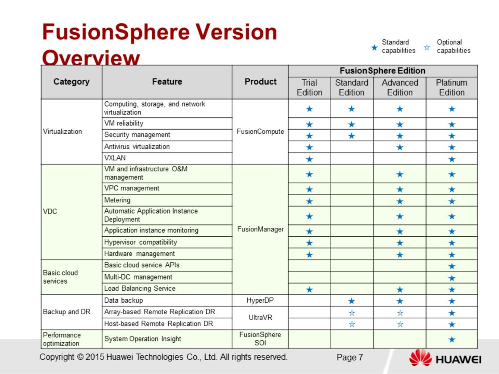

The FusionSphere Operation Insight (SOI) implements advanced analysis on running systems. It collects and display VM performance indicators in the FusionSphere cloud system, models and analyzes collected data, and provides suggestions on system performance management. Displays indicators ins terms of health, risks, and efficiency.
Fusion Sphere SOI not only displays historical data, but also predicts future trends.

### Huawei FusionCube Solution
Fusioncube has three main features: converged, simple, and powerful.
**Converged** means that integrates computing, storage, network resources, virtualization platforms, databases, and application software.
The core of the FusionCube integration is the distributed cloud computing software (FusionCompute, FusionManager and FusionStorage).

**Simple** means that FusionCube supports resource sharing, and capacity expansion. The software and hardware are all Huawei-developed products.
The distributed cloud computing software virtualzes different hardware resources into a unified pool of virtual resources.
FusionCube supports linear and smooth expansion in capacity of blades, subracks and cabinets, which ensures uninterrupeted operation of upper-layer applications irrespective of changes in hardware.
**Powerful**. Software-defined storage architecture(FusionStorage) that eliminates I/O performance bottlenecks.
FusionStorage employs distributed server SAN architecture, high-speed IB networks and SSDs.
FusionCube can be used for desktop virtualization, Enterprise cloud data centers and Database acceleration.

### Huawei FusionAccess Solution
One FusionAccess can handle up to 20.000 virtual desktops.

# 4 Huawei Cloud Computing Hardware System
------------------------------------------------
#### Cloud Computing Hardware Overview
Huawei devices are compatible with mainstream servers and storage devices from vendors such as IBM, HP, and Dell.
It is composed by TCs on the user side; and on the data center side it has server, storage and network.
### servers
##### E9000 server
This blade server integrates elastic computing, storage, and networking resources.
It features reliability, availability and serviceability (RAS), high computing density, energy saving, high-midplane bandwith, intelligeent management and service, elastic configuration, flexible expansion for computing and storage resources, low latency, and network acceleration.

###### High-Performance compute mode:
* Supports full series of Intel x86 CPUs.
* Supports compute nodes of various specifications: 2-socket, 4-socket, half-width, and full-width compute nodes.
* Supports various network ports on mezz modules and acceleration cards.

###### Built-in Large-capacity storage:
* A half-width storage resource expansion module is integrated with half-width compute node to form a full-width compute node.
* Supports fifteen 2.5-inch Serial Attached SCSI (SAS) or Serial Advanced Technology Attachment (SATA) or Solid-state drives (SSDs). SCSI refers to Small Computer System Interface.
* Supports disk installation through removable drive trays and hot swap.
* Supports power-off protection for the write cache.

###### Hardware Overview
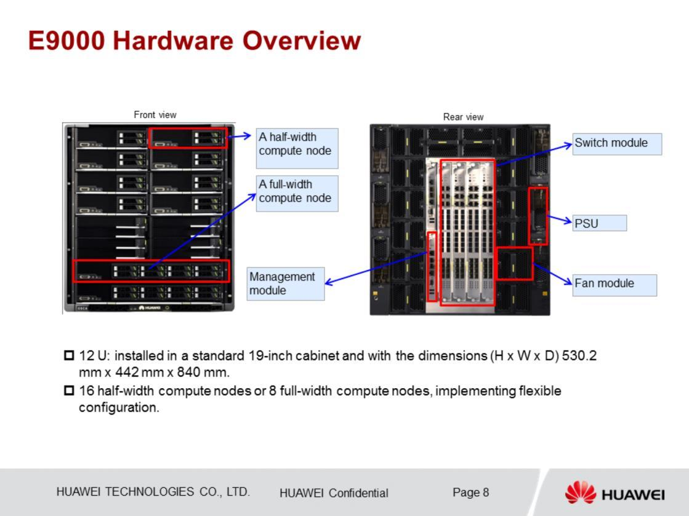
* 8 full-width comopute nodes or 16 half-width for flexible slot configuration.
* A half-width slot supports a compute node with two sockets and 24 DIMMS, or two sets two sets of two sockets and eight DIMMs.
* A full-width slot supports a compute node with four sockets and 48 DIMMs.
* A chasis provides the computing density of 64 processors or 768 cores with a maximum memory capacity of 12 TB.
* The maximum mid-plane switch capacity reaches 15.6 Tbit/s.
* Four switch modules (in two pairs) support Ethernet, fibre channel (FC), fibre channel over Ethernet (FCoE), and Infiniband(IB) swithching protocols and provide I/O ports on panels.

**E9000 Management Module**
The MM910 manages E9000 blade server chassis and compiles with IPMI v2.0 specifications. It provides functions including remote startup, shutdown, reset, logging, hardware monitoring, SOL, KVM over IP, virtual media, fanmonitoring, and PSU monitoring. It also supports 1+1 redundancy.
The MM910 provides local KVM ports for server management.
Each chassis is configured with two MM190s inactive/standby mode. They support active/standby swithover and hot swap.

**E9000 compute Nodes**
* CH121 half-width. 2x8-core E5-2690 CPU. 24 x DIMM, max of 768GB
* CH222 full-width. idem + 15x2.5-inch disks, suitable for big data and distributed processing.
* CH240 full-width. Four E5-4600 CPUs. 48 x DIMM, max of 1.5 TB. 8x2.5-inch disks suitable for database applications.
* CH240 full-width. Four E7-4800 CPUs. 32 X DIMM, max of 1.0 TB. 8x2.5-inch disks, max of 8 TB suitable for database applications.

**E9000 Switch Modules**
From 10GE to 40GE and 100GE. Each E9000 chassis provides 128 10GE upstream ports, and support various interfaces types, such as Ethernet, IB, and FC.
IB QDR/FDR and Infiniband quad data rate/fourteen data rate.
A transparent interconnection of lots of links (Trill) can meet random VM migration, non-blocking, low-delay data forwarding, multi-tenant, and large network scale.

**Mezz Modules on E9000 Compute Nodes**
The mezz module is used for I/O expansion and supports NICs and SAS cards.

##### RH2288H server
It supports HPC, databases, virtualization, basic enterprise applications, and telecommunication service applications.

### Storage devices
##### OceanStor 5600/5800 V3
* Supports 16Gbit/s FC and 10 Gbit/s FCoE host ports. Up to 40 GB/s of bandwith, 4 TB cache capacity, and 8 PB storage capacity.
* SAN and NAS converged to reduce total cost of ownership (TCO).
* Scabalability up to eight controllers.
* Storage 5600 V3 5800 V3 uses disk and controller separation architecture (3U independent engine).
* Controller module and BBUs support redundancy and provide high availability.
* Controller enclosures can be managed in a cascading manner.
* All ports use a modular design, facilitating replacement and upgrade.
* 4 U of 75 x 3.5-inch disks in a 5 row x 15 columns
* Disk enclosures connect to controller enclosures using Mini SAS HD cables or are cascaded to other disk enclosures to implement capacity eexpansion.

### Switches
##### S5700 Series GE Switch
* ESD: Electrostatic discharge jack
* Developed by Huawei based on versatile routing platform (VRP)
* dual power supply sockets and hardware-based Ethernet OAM.
* 10 GE uplink capacity.
* Energy Efficient Ethernet (EEE).
* S5700 supports intelligent stack (iStack).

##### S6700 high-density full-10GE box-type Switch
For long distance stack, a maximun of 40 Km and 48 ports in 1 U.

### TCs
Huawei can provide of different Thin Clients. Some TC can be hardened, such as forbidding use of USB flash drives.

### Typical Hardware Deployment Modes of Cloud Computing
* Typical virtualization configuration: E9000 (Half-width blade) + IP/FC SAN+GE /10GE switches, and software FusionCompute+FusionManager.
* Virtualization configuration: RH2288H + IP/FC SAN+GE/10GE switches.
* When FC SAN are used for networking, FC switches need to be added.

##### Standard desktop Cloud
E9000 + IPSAN + GPU(optional) + GE/10GE switches + TCs(optional), software FusionCompute + FusionManager + FusionAccess, and 5000 VMs in a cluster.

The standard desktop solution does not support automatic deployment and preinstallation.

GPU solution: Each full-width blade supports four Q2000 GPUs or four Q4000 GPUs. A 1.5 U blade supports four GPUs.

##### Desktop Cloud Appliances
* RH2288 + FusionStorage + GE/10GE switches + TCs(optional), and software FusionCompute + FusionManager + FusionAccess + FusionStorage.
The appliance supports automatic deployment and pre-installation and 3000 VMs in a cluster.
* E9000 (full-width) + FusionStorage + GE/10 GE switches + TCs (optional), and software FusionCompute + FusionManager + FusionAccess + FusionStorage.
The appliance supports automatic deployment and pre-installation and 3000 VMs in a
cluster.

# 5 FusionCompute Architecture
----------------------------------------------------------
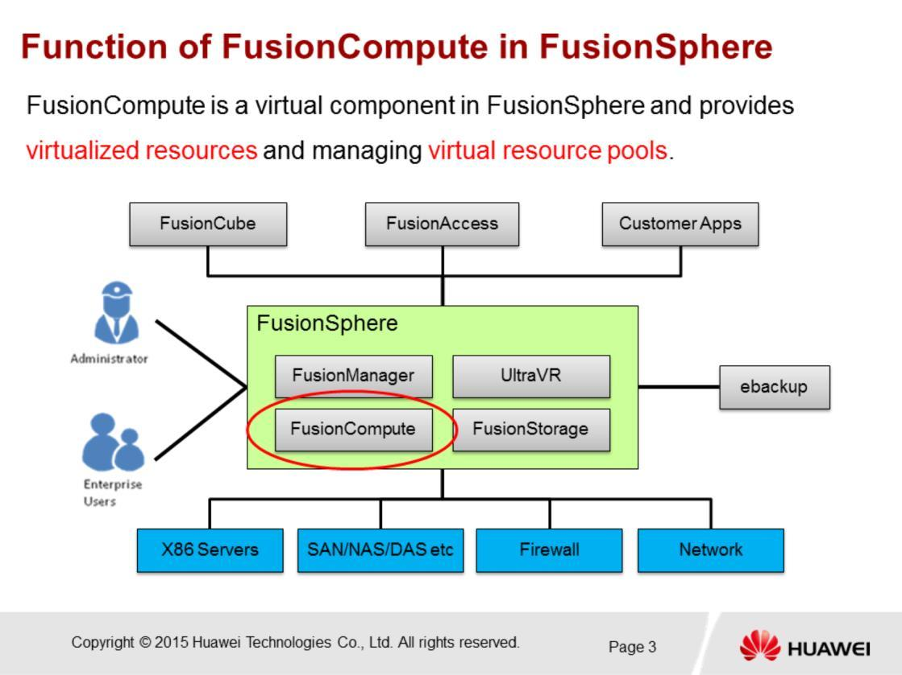
* Resource virtualization virtualizes physical resources. For example, one 2.4 GHz CPU can be virtualized to three vCPUs with the specifications of 1.2 GHz, 0,8 GHz, and 0.4 GHz, respectively for three VMs.
* *FusionManager is cloud management* software.
* *FusionCompute virtualizes* x86 servers, storage and network devices into elastic IT resource pools.

#### FusionCompute Customer Values
##### Improving Resource utilization
Integration ratio: for example, 70 VMs are created on six blade servers, the integration ratio is 11:1 (round up 70/6).
##### Improving the availability
High Availability (HA). This feature minimizes the downtime caused byt routine maintenance.
Fault Tolerance (FT) ensures an expected performance in the case of one or more failed components
#### FusionCompute System Architecture
* Virtual Resource Management (VRM)
* Virtual Node Agent (VNA)
* Management Interface, such as WebUI.
* Policy-based distributed resource management services.
* REST APIs are open source management interfaces for WebUI.
* Basic computing resource management services.
* Data service provides data access services.
* Connectivity services allows upper-layer management to gain access to underlying CNAs and databases.
* Databases uses Huawei-developed GaussDB database to store various management data.

##### Flexible and Scalable
* VRM is the FusionCompute management node, which is responsible for resource allocation
and scheduling, and provides unified O&M, resource monitoring, and resource management
functions.
* CNA implements virtualization.
  * Each logical cluster supports 128 physical servers.
  * Each logical cluster supports 3000 VMs.
  * HA design and VRM (on VMs or physical servers) deployed in active/standby mode ensure system availability.
  * Large-capacity design is used to cascade a max of 16 VRMs to support 4096 physical servers and 80,000 VMs.
* A pair of VRM nodes manages small-scale data centers to ensure thin provisioning. Large-scale data centers are managed by multiple cascaded VRMs.
* Two VRM nodes are promoted as the Primary Domain Coontroller (PDC). The web clients of all VRMs must be connected to the VRMs functioning as the PDC.

#### FusionCompute Features
**Compatibility with Special OSs in the industry**
Xen architecture and PV driver.
Huawei has paravirtualization (PV) driver developing capabilities, allowing FusionCompute to be compatible with new OSs.
FusionCompute is compatible with mainstream Windows and Linux OSs.
**Flexible VM Configuration Adjustment**
- Quality of Service (QoS) is used to measure transmission quality.
- The VM hot CPU and memory add functions must be supported by OSs. Therefore, FusionCompute does not support hot CPU and memory remove.
- FusionCompute supports online capacity expansion and disk reduction.
- Vertical scalability (scale-up): improves the VM resource configurations to provide better performance and QoS.
- Horizontal expansion (scale-out): adds nodes to improve the performance and Qos of the entire cluster.

**Memory Overcommitment, Increasing the VM Density by 50%**
* The memory over commitment function is configurable.

* Memory sharing and copy on write: The VMs sharing memory must run the same OS.
  * Memory sharing enables VMs to share the same physical memory space. In this case, the memory is read-only for these VMs.
  * Copy on write: If data must be written to the memory space, VMs create another memory space and modify the mapping.

* Memory swapping enables VM data that has not been accessed for a long time to be moved from the VM's memory space to a storage device, and the system creates a mapping for this movement path. The data is moved back to the
VM's memory space when the VM needs the data. The unused memory is swapped to the VM storage space. The large memory pages are supported in this technology.
* Memory balloon. The Hypervisor uses the memory bubble technology to release memory of idle VMs for VMs with a high memory usage to use.
* The balloon driver applies for an available memory page in the source VM, grants the page to the target VM according to the grant table, and updates the mapping between the physical addresses and VM machine addresses in the table.

**VM Live Migration**
* heterogeneous CPUs indicate different CPUs from the same vendor.¿?
* Memory compression technology is used to compress the memory data, reducing network bandwith.
* FusionCompute uses the zero-memory compression technology to store only copy of the zero-memory pages (which is simmilar to deduplication).

**VM HA** (High Availability)
FusionSphere 3.1 supports VM HA.
FusionSphere enhanced the HA mechanism by introducing VRM-independent HA. The enhancement enables a single node to be automatically elected as the master node when you create a HA cluster. The master node maintains management and
storage heartbeats with slave nodes. A loss of the heartbeat enables the master node to trigger VM HA. Management plane heartbeat is implemented by heartbeat packet transmission, and storage plane heartbeat is implemented by writing data to files. The loss of both management and storage heartbeats will trigger VM HA. Users can configure whether to use the management plane or non-management plane to detect storage heartbeats based on the network plane loads.
  * Limitation 1: The VRM-independent HA can be used only when all hosts in the cluster use Virtual Image Management System (VIMS) storage.
  * Limitation 2: To ensure reliability, a cluster that has VRM-independent HA enabled can accommodate a maximum of 32 hosts.

**FT** (Fault Tolerance)
Differences between FT and HA:
  * FT synchronizes data between the active and standby nodes in real time. Short time and High costs. Only applies to key systems with HA requirements.
  * HA uses the dynamic scheduling policy, which migrates the VM that is faulty to the destination host. Slower but low cost.

**Dynamic Resource Scheduling**
* Supports manual or automatic configuration of scheduling policies.
* The load balancing is implemented in a logical cluster.
* In Huawei server solution, a logical cluster includes 128 servers.
* If a performance load of all VMs in a cluster is lower than the scheduling baseline, the scheduling is not enabled, even if the load variance exceeds the threshold specified by users.

**Dynamic Power Management**
* DPM policies can be configured and DPM takes effect only when DRS is configuredd for the cluster. DRS is required to migrate VMs when the system executes the DPM policies.
* The thresholds ranging from coservative to radical indicate the energy-saving policies with different sensitivities.

**Fine-Grained  Resource Management of QoS, Ensuring VIP Service Availability**
* QoS is used to measure the transmission quality.
* The CPU QoS cannot temporarily add CPUs to a VM.
* The memory and network QoS mechanism are similar.

**Architecture of NUMA Affinity-based Scheduling**
* NUMA. Each physical computer has multiple CPUs connected by a front side bus. The CPUs and the corresponding memory modules constitute a NUMA system.
* A CPU and its interconnected memory constitute a node.
* RAM. Random Access Memory.
* NUMA nodes are introduced in physical servers to improve memory access efficiency of CPUs. A CPU can achieve its maximum memory access efficiency when accessing memory within its own NUMA node. But, if any VM OS or applcation requires a second NUMA node, the overall performance will deteriorate. In this case, Guest NUMA, and enhanced NUMA feature, enables that the NUMA topology is transparently transmitted to the VM and enables VM to preferably use memory resources on one NUMA node, thereby improving memory performance.

**GPU Hardware Virtualization**
Technical Principle:
Multiple vGPUs are created on a physical GPU, which can use Direct Memory Access (DMA) to directly obtain the 3D commands delivered to the vGPU driver by graphics applications. After the GPU renders the graphics, it stores the graphics to the video RAM of each vGPU. Then the vGPU driver in the VMs can directly captuure rendering data from the physycal memory.

**Remote CD/DVD-ROM Driver Mounting**
A VM can read data of the CD-ROM drive attached to the host.

**Virtual Cluster File System - VIMS**
The Virtual Image Management System (VIMS) has the following features:
* Opensource OCFS2
* Manages the VM image and configuration files as files
* Uses jbd2 to record logs
* Uses distributed lock mechanism to ensure data read/write consistency
* Uses the disk heartbeat to detect the connection status with the SAN
* Uses the network heartbeat to detect the connection status between the nodes.

Thin provisioning: The allocated space is separated from the actual space.

**Storage Live Migration, preventing Service Downtime During Storage System Maintenance**
* Supports data migration between clusters.
* implements power-off maintenance for the storage system.
* Optimizes VM storage I/O performance.

**Storage Thin Provisioning, Dramatically Reducing Storage Investment**
* The disk space size a VM user can use is the configured space only. The space that can be allocated to a VM is adjustable based on actual usage.
* Supports storage reclamation.
* Reduces the storage cost up to 40%
* Large storage capacity and low IOPS requirements.
* Compared with common storage modes, thin provisioning allows a storage device to support more VMs. Therefore, the IOPS of a single VM reduces.

**Linked clone Technology, Improving Management Efficienci and Saving storage Space**
* Multiple linked clones can share one master disk which requires cache acceleration, and each linked clone must also have one delta disk. If multiple users share a master disk, the costs can be reduced. The size of a delta disk is about
1/3 that of the master disk. Therefore, the costs can be reduced by 60%.
* The test period is 12 seconds.

**RDM for Storage Resources**
* Raw Device Mapping (RDM) allows VMs to directly access a physical storage device.
* SCSI is a protocol to connect a host to a storage device, in a distance of 25 meters or shorter.
* Logical Unit Number(LUN) is a logical disk that comprises all or some physical disks on a SAN storage device.

**Support for VXLAN**
VXLAN adopts an outer User Datagram Protocol (UDP) tunnel as a data link layer
and transfers original data packets as tunnel payloads. With the outer UDP tunnel,
inner payload data can be quickly transferred on the layer 2 and layer 3 networks.
* New packet format: VXLAN outer encapsulation (tunnel) + Original inner payloads: Virtual network identifier (VNID) can be extended from 12 bits (4096) to 24 bits (16 million), and can be transmitted across the layer 2 network.
* Virtual tunnel end point (VTEP), a logical entity, is used for VXLAN packet encapsulation and decapsulation. It is assigned an IP address of the physical network to connect to the physical network.
* A VXLAN gateway is defined in the VXLAN network to implement communication between virtual networks and between virtual networks and physical networks.

**10GE Gateway for Key Applications and I/O-Demanding Scenarios**
Differente hardware devices support different technologies for VMs to communicate with external networks.
* Common vNIC
  * The hypervisor (dom0) implements network I/O between VMs in the same host, or VM's external data transmissions
* VMDq-enabled NIC
    * Huawei-developed intelligent network interface card (iNIC) supports the Virtual Machine Queues (VMDq) technology.
    * VMDq implements layer 2 classifier/sorter using hardware. Data packages are directly sent to NIC queues based on MAC addresses and VLAN information without passing through the domain 0.
* SR-IOV
  * This allows physical NIC to create multiple physical functions (PFs), each of which provides multiple virtual functions (VFs).
  * This feature allows a VM to exclusively use a VF which is derived from a PF. The VM can drectly use physical NIC without CPU overhead caused by virtual swithching.
  * Live migration and snapshot features are unavailable on SR-IOV.

#### FusionCompute specifications
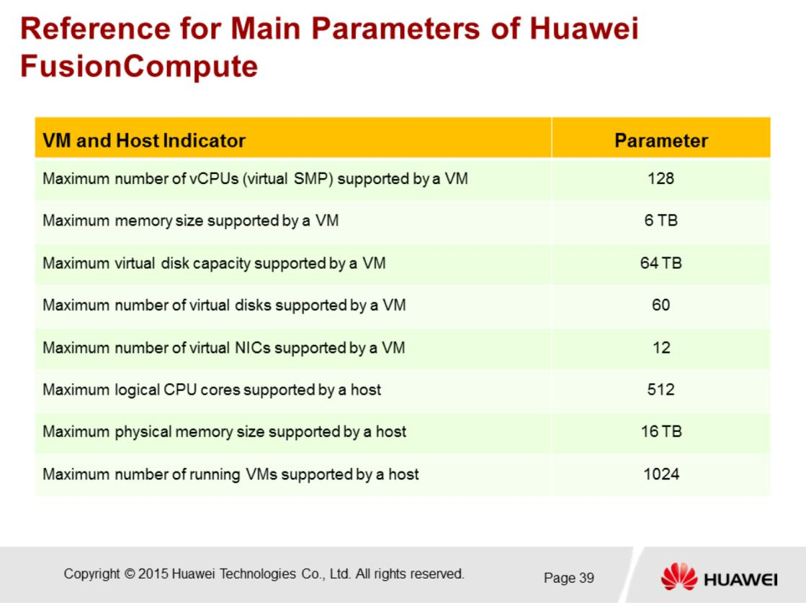
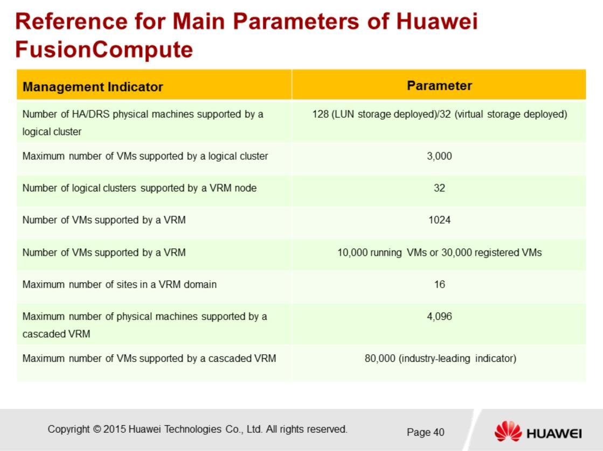
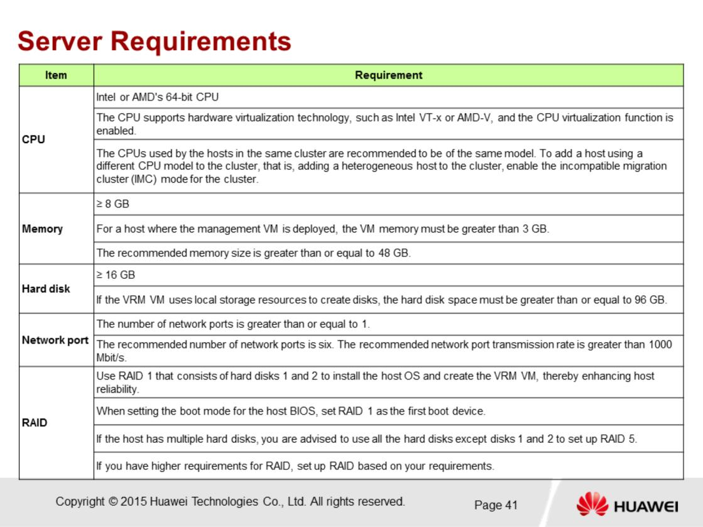

As a mature open-source software product based on Xen, FusionCompute has made significant system simplification, security hardening, and function enhancement.
Therefore, it consumes little resources and can be installed on a server with only 8 GB memory (48 GB is recommended) and 16 GB hard disk space.

# 6 FusionManager Architecture and Basic Principles
--------------------------------------------------
FusionManager resolves the preceding problems of Managing heterogeneous virtualization platforms, for example, Huawei's FusionCompute and VMware's vCenter.

Centrally managing physical devices, for example, monitoring servers, CPU temperatures, fans and receiving alarms.

Secure Network Isolation.

Allocating virtual resources.

Centrally manage multiple and independent data centers.

Introduction of the concept of VDC:
A VDC is the primary unit of virtual resources managed in the FusionManager system. Several VDCs can manage the all the virtual resources.
Each VDC can contain multiple users that are managed by the VDC admin, who can add or delete users to or from a VDC and configure each user.

### Core features

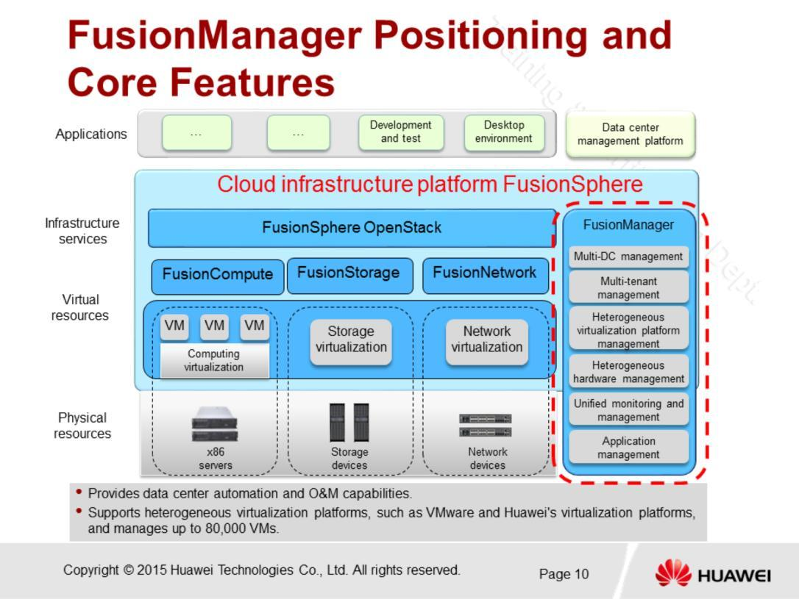

* FusionManager provides:

  * Resource pool management capability:
    * Managing heterogeneous virtualization platforms, for example, Huawei's FusionCompute and VMware's vCenter.
    * Centrally managing hardware, for example, physical servers from Huawei, HP, and Dell, storage devices (IP SAN and FusionCompute SAN), and network devices (switches and firewalls).
    * Centrally managing alarms reported by various Huawei components and hardware devices.

  * Multi-DC management:
    * Multi-tenant management capability.
    * Automatic application management capability. FusionManager supports application template creation and rapid provisioning of application templates.

### Multi-Tenant ¬ Multi-VDC management
A VDC is a unit of virtual resources assigned for tenants.

A tenant is called an account in industry, a project in OpenStack, or an org in VMware. Usually, a tenant is a independent user or an enterprise.

A VDC is a unit of virtual resources assigned for tenants.

### Secure and Isolated Network Environment Provided by a VPC

* Isolated environment: The VPC provides isolated VMs and network environments, meeting the requirements of isolating networks between various departments.

* Comprehensive services: Each VPC can provide the independent virtual firewalls, elastic IP addresses, virtual LBs, security groups, super VLANs, IPSec VPNs, and NAT gateway services. Some of these functions are provided using virtual service appliance (VSA).

* Flexible networking: The VPC provides multiple networking modes, such as direct network, routing network and internal network.

* Convenient charging method: FusionManager provides pay-per-use and traffic-based resource charging modes.

### Design Concepts
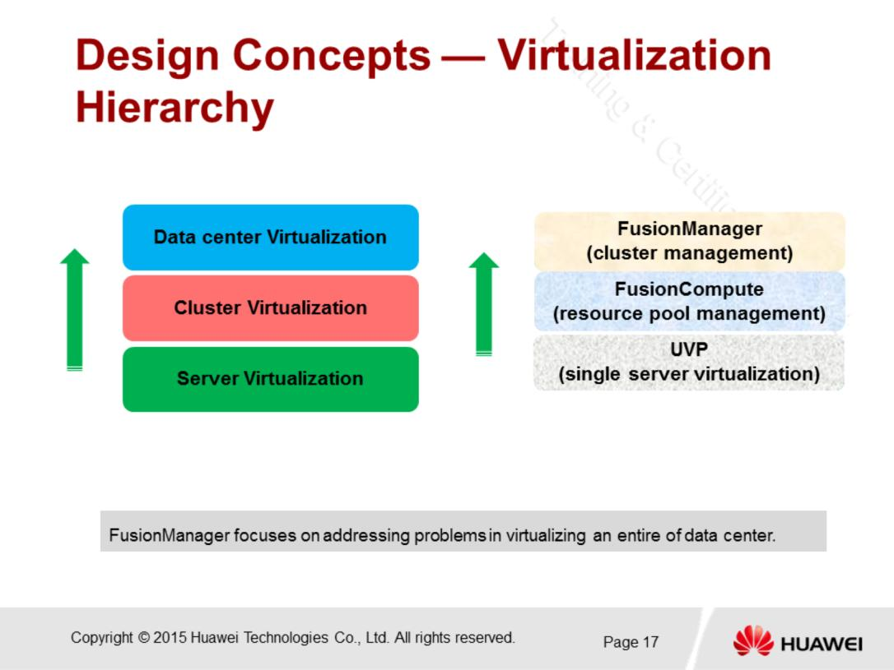

### Public vs Private Cloud Scenarios
In a public cloud scenario, FusionManager allows the system admin to build, manage, and perform maintenance for a cloud platform.

In a private is the same as public, but also allows to users to complete resource creation, resource management, and resource usage statistics.

### Administrator - Service & Operation Administrators
System Admins can be classified into the service administrtor and operation administrator.
* The service admin is responsible for service operation.
* The operation admin builds, manges, and performs maintenance for resource pools.

### Tenant/User/Quota
* A VDC is a unit of virtual resources assifned for tenants.
  * A tenant is called an account in industry, a project in OpenStack, or an org in VMware.
  * For example: Amazon is a well-known public cloud carrier. An individual customer or enterprise can register Amazon. In this case, the individual customer or enterprise is called a tenant.
* Quota restricts the amount of resource used by tenants.
* a user in FusionManager can play different roles in different VDCs, that is, a user can exist in multiple VDCs.

### Architecture Reference
FusionManager uses service-oriented Architecture (SOA) to support application delopment. The core components in SOA are described in the next picture:

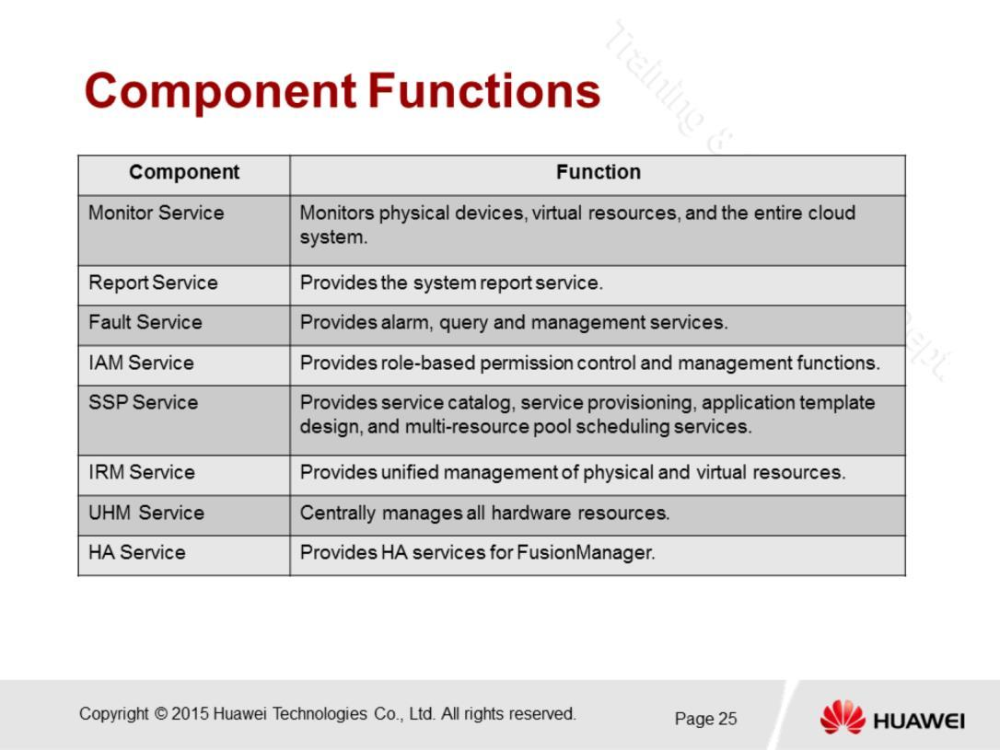
* *Northbound*
  * FusionManager probides multiples northbound interfaces, including RESTful, SOAP, Java SDK, and SNMP interfaces.
* *Southbound*
  * FusionManager can monitor and manage heterogeneous hardware devices. FusionManager also provides drivers required for new hardware based on its extensive monitoring framework. Users can put drivers into use after hot loading these drivers on FusionManager.
  * FusionManager supports Huawei's FusionCompute and VMware's virtualization platforms using the drivers. FusionManager is planned to support Microsoft's Hyper-V soon.

## FusionManager Core Functions
The tree root is the menu name, and the modules below the  root are core functions.

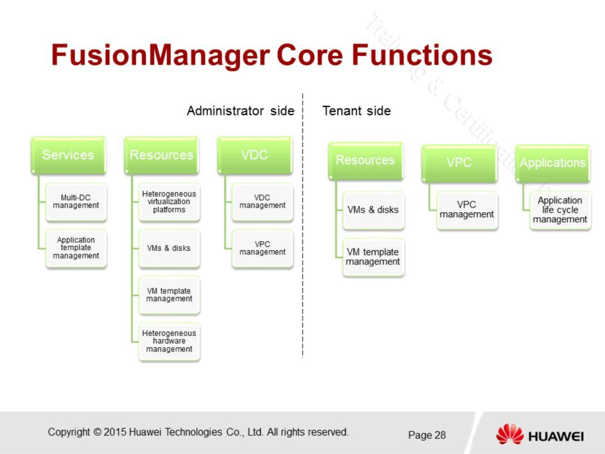

**Multi-DC Management**
* FusionManager can be deployed in Top-Local mode when managing multiple data centers. This mode is also called distributed deployment architecture.
* In this deployment mode, each Local FusionManager node manages the resources in a single data center. The Top FusionManger node itself uses the resources in the entire data center (by FusionSphere cascading on web client) to prvide tenants with services.
* the *Top FusionManager administrator* and *Local FusionManager administrator* are *service admin* and *operation admin*, respectively.

**Heterogeneus Virtual Resource Management**
FusionManager uses separate drivers for various virtualization platforms, such as VM, disk, and network management.

Huawei's FusionCompute virtualization uses REST interfaces to interact with drivers. VMware's vCenter uses VMware's SDK to interact with drivers.

A third party can also use FusionManager's open REST interfaces to perform secondary development.

**Hardware Device Management and Monitoring**
* FusionManager monitors and manages servers, network devices (such as switches, firewalls, and load balancers), and storage devices (such as IP SAN and FC SAN).
* New plug-ins can be developed for new hardware and be hot loaded to the system.
* Device alarms are sent to FusionManager using Simple Network Management Protocol (SNMP).
* Device maintenance operations are performed using Intelligent Platform Management Interface (IPMI) and SNMP protocols.

**VPC Management**
* Users can create their own VPCs in a VDC
* Users canuse various network services, such as routers and virtual load balancers (VLBs) in a VPC
* In tenant view, users can clearly view the VPC network topology, which facilitates VPC mintenance and management.
* The VPC security management functions are implemented on firewalls:
  * In hardware firewall networking, multiple virtual firewalls are created using the virtualization capability of the hardware firewall.
  * The software firewall is similar to the hardware firewall, but the hardware uses Huawei's software virtualization solution to virtualize software firewalls. Each software firewall runs on one VM.
* The router capability of the VPC is provided by firewalls or switches based on the actual physical networking.

***Automatic and Graphic Deployment of Applications Using Templates***

# 7 FusionAccess Architecture Principles
-----------------------------------------
FusionAccess provides a GUI for administrators to provicion, maintain, and reclaim virtual desktops.
The Huawei FusionCloud Desktop solution consists of FusionCompute, FusionManager, and FusionAccess.

FusionAccess consists of three parts:
  * The cloud platform provides virtual desktops for users.
  * The desktop access component manages and assigns virtual desktops.
  * Terminals connect users to virtual desktops.

Asset management is implemented on ht management portal of the IT adapter (ITA).

**User Access Control**
* Users can view their own virtual desktops by using browsers.
* Users can start, restart, and log in to their own virtual desktops.
* FusionAccess manages the status of all virtual desktops.

**Desktop Transfer Protocols**
* VMWare View use remote desktop display protocols as the HDP, RDP and PC over IP (PCoIP). HDP's performance leads the industry. It provides:
  * requires low bandwidth
  * Supports more peripherals
  * Implements unified control by using a console
  * Optimizes performance based on scenarios by setting policies on the Huawei Desktop Controller (HDC), for example, enabling the compression function to reduce the definition if bandwidth is insufficient, and disabling redirection of peripherals to VMs in high-security scenarios.

### FusionAccess Architecture and Components
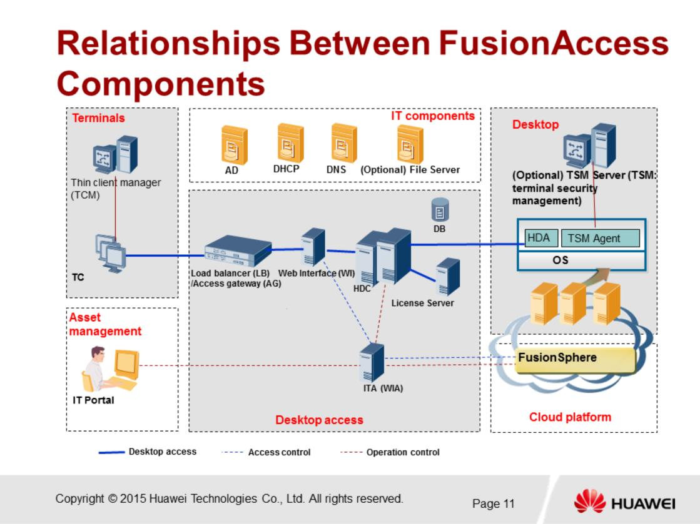

**FusionAccess Components**
* Terminal Components
  * Hardware: TC
  * Software: TCM
* Desktop access components
  * Software: HDC, License Server, WI, and Huawei Desktop Agent(HDA)
  * Hardware: SVN, serving as LB and an AG
* Automation management components
  * Software: ITA
* Desktop software management components
  * Software: TSM (including the server Agent)
* IT architecture components
  * Software: activve directory (AD), Dynamic Host Configuration Protocol (DHCP), domain name server(DNS), and File server

##### **Desktop Access Components**
* *WI*
  * The WI provides a web login page for users
* *License Server*
  * The license Server determines whether users'licenses are sufficiente when users access VMs through the HDP
* *SVN*
  * The SVN balances loads between WIs
  * The SVN also serves as the HDP protocol gateway to isolate the intranet from the extranet and implement transmission encription
* Huawei Desktop Controller (HDC)
  * The HDC, as a core component of the desktop virtualization, stores the associations between virtual desktops (domain names) and users (domain accounts) and synchronizes the usage state and connection state of virtual desktops in real time
  * During desktop access, the HDC provides VM access information for terminals
* *HDA*
  * The HDA is installed on VMs. It connects users to desktops by using the HDP and reports VM status and connections to the HDC

**HDC**
* The HDC provides thefollowing functions:
  * Establishes and maintains mapping relationships between users and virtual desktops
  * Provides access information for the WI during user access.
  * Collects VM status and connection information from HDAs installed on VMs
* Administrators create, provision, and maintain VMs on the ITA portal. The ITA invokes the interface provided by the HDC
* The WI provides a web page for users to log in to VMs
* The HDA is desktop agent software developed by Huawei. The HDA is installed on each users to log in to VMs
* LDAP is short for Lightweight Directory Access Protocol. AD is a typical instance of the LDAP
* The HDC is a core component of FusionAccess and dominates in the FusionAccess software architecture

***Licenses can be purchased based on the number of users or concurrent users***

***The HDA is isntalled on each user VM to connect a terminal and a VM***

**WI**
* WI is a web service that provides a web browser for users to log in to VMs
* After a user enters the domain username and password on the WI login page and passes authentication, the user can view the assigned VMs on the WI and clicks a VM to log in.

**LB and AG**
* The LB and AG share one hardware platform SVN and can be deployed together.
* The LB and AG are logically independent of each other.
  * The LB implements load balancing between WIs
  * The AG serves as a desktop access gateway agent to isolate the intranet from the extranet
* In small-scale scenarios with fewer than 600 VMs, software-based virtual load balancers (vLBs) and virtual access gateways (vAGs) can be deployed
* SVN provides load balancing and gateway functions
* The SVN is an application switch, which performs traffic analysis on specific applications to assign and optimize the network traffic of web applications at layer 4 to layer 7 intelligently and securely
* The SVN provides two main functions: switching and security protection. the SVN processes HTTP access requests, provides load balancing for TCP based connections, ensures secure connections, and implements Network Address Translation (NAT)
* The AG is a viirtual private network over Secure Sockets Layer (SSL VPN) devicce that provides applications securely based on SmartAccess control policies. Users can access any application or data anytime through the AG. Enterprise users can also access data center resources from an extranet through the AG. In addition, access control can be implemented based on various SmartAccess control policies. The AG also support user authentication, access policy settings, and NAT

##### **Automation Management Components**

**ITA and WIA**
* The ITA and WIA are the same product and presented as the ITA. The Ita and WIA functions can be set as required.
* The ITA provides standard functional interfaces for the IT Portal. VMs can be created, attached, deleted, and detached through the portal.
* The WI starts and restarts VMs through the WIA.
* The ITA or WIA serves aas a Tomcat-based web service. The ITA or WIA provides unified interfaces for the upper layer IT Portal and interfaces for the underlying HDC, FusionSphere, VMs, and DNSs.
* The working principle of te WIA is: When detecting that a VM is shut down, the WI sends a VM start message to the WIA. After obtaining the VM ID from the message, the WIA sends a start command to FusionSphere.

##### **Terminal Components**

**TC**
* A TC is a terminal used for desktop access. It's a mini PC.
* The TC supports Linux and Windows WES OSs and also supports HDP- or RDP-based clients for user access.
* When a user clicks a VM on the WI, the user can be automatically connected to the VM through an HDP-enabled terminal.

**TCM**
* A management server provides centralized management for TCs, including version upgrade, status management, information monitoring, and log management.
* The management server can detect TCs to be managed automatically and manage them.

###### **Application Virtualization Component**

**SBC**
* Server-Based Computing: publishes the application system clients (such as the OA and core services) that are installed on the background server to virtual delivery platform. When a user logs in to the platform to access a certain background application, the application system client runs on the platform, not on the user's local terminal.

**Technical Features of SBC**
* All applications are installed on the application server. Applications are sent to the client as streams and displayed on the client.

### Basic FusionAccess Service processes

**Accessing the WI**
* The client accesses the LB by using the LB domain name. After receiving the access request, the SVN (LB) distributes the request to a WI based on the load balancing algorithm. the WI returns a login page to the client.
* If the SVN or vLB is not deployed, the client directly accesses the wi. In this case, load balancing can be implemented between two WIs by configuring the round robin DNS.

**Performing User Authentication**
* A user enters the useername, password, and domain name (may be a default value) on the WI login page and clicks Login. The WI sends the account information to the HDC. Then the HDC authenticates the domain account on the AD.

**Obtaining a VM list**
After the domain account passes AD authentication, the HDC queries the VM list in the database and returns the VM list to the WI. The WI displays the VM list to the client.

**Logging In to a Virtual Desktop**
* The login information includes the Address Ticket, Login Ticket, and the IP address and port of the gateway.
* A user clicks a VM from the VM list to log in. The login request is sent to the WI.
* The WI obtains login information from the HDC, including the Address Ticket (VM IP address for intranet access), Login Ticket, and Launch Reference.
* 1. The WI sends a request for querying login information to the HDC.
* 2. The HDC queries the username, password, domain name, IP address, and reference of the VM in the database and returns the information to the WI.
* 3. The WI determines an intranet or extranet connection based on its configuration information.
  * For an intranet connection, the WI sends the username, password, and domain name to the STA to obtains a Login Ticket.
  * For and extranet connection, the WI sends the username, password, domain name, and IP address of the VM to the STA to obtain a Login Ticket and an Address Ticket.
* 4. The WI puts the VM IP address (or Address Ticket), Login ticket, and Launch Reference (indicates thee validity period of a connection) in a login file based on a template and sends the login file to the client.

**Connecting to a Virtual Desktop**
* The HDP client installed on the TC or SC parses the login information of the SVN and the  connection request.
  * For an extranet connection, the login information contains the AG information of the SVN and the connection request is sent to the AG.
  * For an Intranet connection, the login information containsthe VM IP address and the client directly connect to the VM based on the VM IP address.
* When the SVN (AG) receives the connection request, it does not know the IP address of the VM to be connected. Therefore, the SVN sends the Adress Ticket to the HDC to obtain a real VM IP address. After obtaining the Real VM IP address, the SVN (AG) sends connection request to the HDA of the VM.
* After receiving the connection request, the HDA needs to verify thee Login Ticket and license. If verification succeeds, the HDA logs in to the VM.
* Login Ticket verification:
  * The HDA obtains the Login Ticket from the request and sends it to the HDC by using the HDC ITicketing interface throudh which the HDA is registered.
  * Then the HDC sends the Login Ticket to the STA to obtain the username, password, and domain name and returns the information to the HDA.
* License verification:
  * The HDC sends a request for querying wheter any available license exists to the License Server. The License Server checks the current usage of license and returns the result.

### Basic FusionAccess features

**Branch Office**
* Each enterprise, apart from its headquarters, has many branch offices. for the branch desktop cloud, TCs can be deployed in branch offices. In the desktop cloud solution for the branch, service systems are deployed in the branch. This ensures sufficient bandwidth and short latency, and lowers requirements for the network between the headquarters and the branch.
* The branch office feature supports the centralized O&M of dispersed virtual desktops, including hardware management and monitoring, virtual resource management and scheduling, unified alarming, unified operation logging, SSO, and TC management.
* The branch office feature supports the centralized provisioning of virtual desktops, pprovisioning services for branch offices in a unified manner.
* Services and maintenance operations in a branch are not affected when the network between the headquarters and the branch is interrupted.
* A maximum of 20,000 VMs of branch offices can be centrally managed. up to 256 branch offices are supported. Each branch office support up to 500 VMs. Sub-branches are not supported. the network bandwith between the headquarters and the branch office must be higher than 2 Mbit/s. Only one VM in a branch office can be logged in using virtual network computing (VNC) on the management portal, because VNC login occupies 1.5 Mbit/s to 2 Mbit/s bandwidth.

**Linked Clone**
A shared read-only base volume provides the VM OS and space for VMs to store personalized data. this redduces required system disk space. The linked clone desktop pool provides unified costs and improves desktop maintenance efficiency.

**Fingerprint Authentication**
* It applies to virtual desktop logins and virtual application access.
* Domain and fingerprint two-factor authentication:
  * Before logging in to a virtual desktop using fingerprint, you need to register or modify the fingerprint on the WI login page. Fingerprint information is encrypted and stored on VMs and the fingerprint information of only one user can be registered on each VM. A maximum of 10 fingerprints can be registered for each account.
  * A user can log in to the desktop cloud only after passing both fingerprint and domain account authentication. The user first enter the domain username and password on login page. Then, the user impresses the fingerprint and logs in to the VM if the fingerprint is also authenticated.
* Application system authentication:
  * You need to install the required fingerprint device to the virtual desktop system. The management of fingerprint scanners and the binding of applications are performed by the software of the virtual desktop system. The fingerprint encryption data is stored in the user virtual desktop system.

**USB Key Authentication**
After the USB key is bound with an account, the USB key can be used for virtual desktop login authentication, improving access security. SSO is supported.

**GPU Hardware Virtualization**
* Currently only NVIDIA K1 and K2 graphics cards support GPU hardware virtualization. Each CH221 blade or RH2288 V2 server supports one K1 or K2 graphics card.
* The RH2288H V2 appliance does not support GPU hardware virtualization.
* GPU hardware virtualization VMs do not support high availability (HA).

**Full Memory Desktop**
* full memory desktops not only have the advantages of linked clone desktops, but also have hight read/write performance. On full memory desktops, VMs can be started or restarted quickly.
* Full memory desktops support unified VM template deployment, update, and restoration.
* Full memory desktops can be quickly created and provisioned in batches.

**Quick Provisioning of Virtual Desktops**
* Quick provisioning of virtual desktops includes VM creation and assignment (binding).
* Multiple types of VMs can be created, including full copy VMs and linked clone VMs.
* You can set specifications, networks, disks, and naming rules during VM creation.
* VMs can be assigned in one-to-one mode or pool mode. User information can be imported.

**Virtual Desktop Management**
* VM group: Each VM belongs to a VM group. The VM group information includes the VM group name, type (full copy or linked clone), and description.
* Desktop group: Each VM belongs to a desktop group. The desktop group information includes the desktop group name, type (private or static pool desktops), and description.

**Virtual Desktop System Management**
* Other functions of the FusionAccess management system:
  * Task center
  * Statistics reports
  * Operation logs

# 8 FusionCloud Solution Deployment
---------------------------------------

### Overview
**FusionCloud Solution Logical Architecture**
* Huawei FusionCloud Solutions mainly consist of FusionCompute, FusionManager, and FusionAccess.
* FusionCompute is deployed on the underlying hardware. You are advised to deploy VRM nodes in active/standby mode using VMs.
* You are advised to deploy FusionManager in active/standby mode using VMs.
* FusionAccess consists of multiple component, and all of them are deployed using VMs. Except for Loggeter, components are all deployed in active/standby mode.

**Solution Deployment Process**
* Solution design: Plans data for the management plane, storage plane, and service plane, designs system deployment modes are required network data, and plans nodes and data of software systems.
* Hardware installation: configures hardware devices to meet virtualization software deployment requirements, and ensures communication among devices of different network planes.
* Software deployment: Deploys FusionCompute, FusionManager, ultraVR, HyperDP, and other software as required.
* Service data planning: Creates VMs of required specifications, adds domain users, configures VM and desktop groups as required.

### Solution Planning and Design
**Solution Design**
* The architecture design plans requirements of all components and specifies necessary components:
  * Functions: Specifies whether FusionCompute, FusionManager, Fusionaccess, UltraVR, HyperDP, and a third-party O&M system are required.
  * Storage types: Specifies whether storage is required and the storage type to use, such as FC SAN, IP SAN, or FusionStorage. Specifies the storage networking type, such as GE, 10 GE, or FC and whether old storage devices are used.
  * Networks: Specifies the networks required, such as the BMC plane, management plane, storage plane, service plane, backup and DR plane, and external networks.
  * Backup and Dr: Specifies whether HyperDP, UltraVR, and VIS are required.

### Hardware Configuration
**Hardware Configuration Process**
* *Network configuration*: Log in to the switch, configure VLAN and VLANIF, and configure ports as planned, ensuring communication within each plane and isolation among planes.
* *Storage configuration*: Log into the Integrated Storage Manager (ISM) and:
  * Configure the management IP address and service IP address.
  * Create RAID group and divide LUNs.
  * Create hosts and host group.
  * Map LUNs to hosts or the host group.
* *Server configuration*: Log into the server and configure BIOS and RAID.

**Configuring Networks Devices**
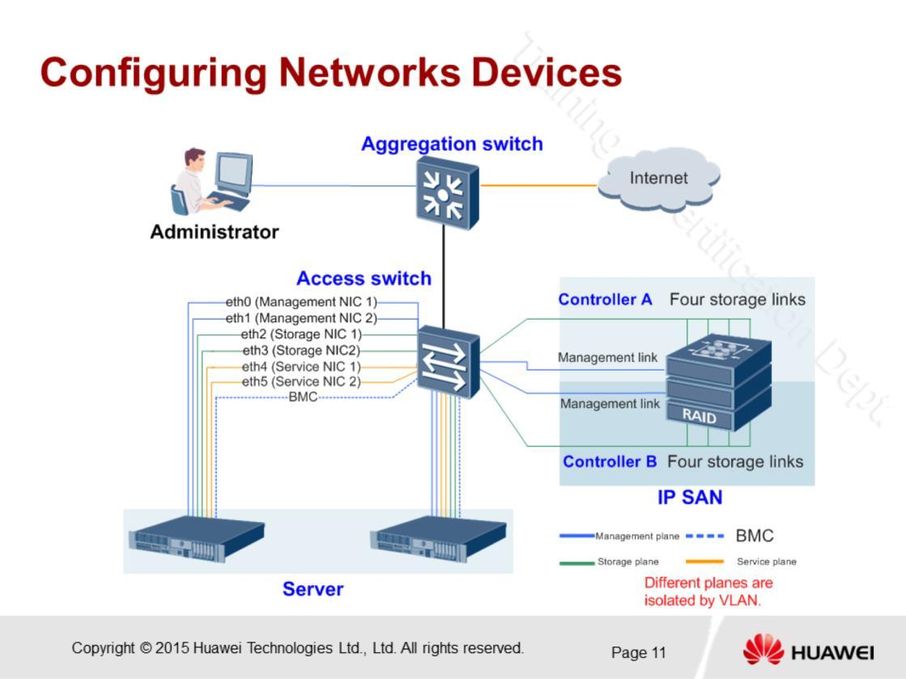
* The BMC plane: Specifies the network planes used by the host BMC network port. If the management plane and the BMC plane on the VRM node can communicate with each other, they can be combined as one.
* The management plane: Used by the management system for managing all nodes in unified manner and managing planes used for communication among nodes.
  * The following IP addresses use the management plane:
    * IP addresses of the management network ports on hosts.
    * IP addresses of VMs deployed on the management node.
    * IP addresses of storage device controllers.
  * You are advices to configure the eth0 port on host as the mangement network port. If a host has more than four network ports, configure both eth0 and eth1 as management network ports, and bind them as a pair of active/standby ports after FusionCompute is installed.

**Configuring Storage Devices**
* The general storage device configuration process is as follows:
  * Connect storage management ports to the switch management plane and configure IP addresses of related management network segments. Connect storage service ports to the switch storage plane and configure IP addresses of planned storage segments.
  * Create RAIDs and set their names, levels, number of disks, and hot spare disks.
  * Create hosts and host groups.
  * Map LUNs to each host and host group.
  * Configure initiators for hosts and hosts groups.
* Data Store Requirements:
  * One data store can be added to only one FusionCompute. If it is added to different FusionCompute systems, its data will be overwritten.
  * When using a data store provided by a shared storage, add the data store to all hosts within one cluster to ensure thatVMs can be migrated within the cluster.
  * To deploy management nodes on VMs, ensure that the data stores to be used by the VMs meet the requirements for the VM disk space.

**Configuring Servers**
* BMC: configure de IP addresses of the planned BMC segments.
* BIOS: Configure Preboot Execution Environment (PXE) and Boot Order and enable the CPU virtualization function, such as VT-x.
* RAID: Configure local disks as RAID.

* In the FusionSphere Solution, requirements for server hardware are as follows:
  * CPUs must support virtualization technology provided by Intel or AMD.
  * To ensure smooth VM migration among hosts, you are advised to employ CPUs of the same model within a cluster.
  * The memory size is greater than or equal to 8 GB. If a host is used for deploying management node VMs, its memory must be greater than or equal to 3 GB.
* You are advised to enable Hard Disk, Network, and CD-ROM as boot devices on servers. Use Network to start the server for batch deployment. Use CD-ROM to start the server for small-scaled deployment. After the installation is complete, configure servers to start from Hard disk by default.
* Configure local disks as RAID 1 to install the OS and service software on the server and improve data reliability. You are advised to configure local disk 1 and 2 as RAID1 and reconfigure 1 to 2 hot spare disks to prevent data loss.

### Software Deployment
#### FusionCompute installation
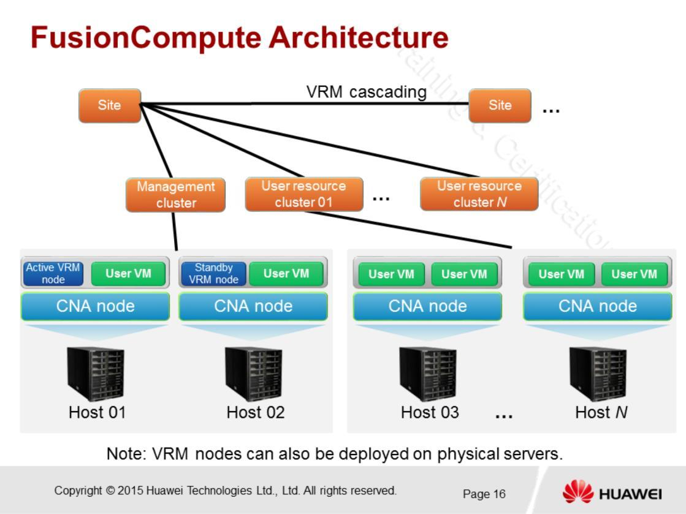
* VRM nodes, the management nodes on FusionCompute, provide centralized virtual resource management on the management portal.
* Hosts, or physical servers, provide computing resources for FusionCompute. When the storages uses local disks, the host provides storage resources as well.
* A physical server with CNA node deployed on forms a computing node. Multiple computing nodes group into a resource cluster. (A management cluster is the one where management VMs on VRM nodes or FusionManager are located. A resource cluster is the one which contains user VMs only). Multiple clusters form a site. The management scope of one VRM node is the management scope of a site. Multiple VRM nodes can be cascaded to manage resources in multiple sites with unified portals.
* Deployment rules:
  * In virtualization deployment mode, VRM nodes are deployed on VMs created on specified hosts in management cluster. In physical deployment mode, VRM nodes are deployed on physical servers.
  * If VRM nodes are deployed in active/standby mode, VRM nodes must be deployed on two hosts in management cluster.

**FusionCompute Installation Flowchart**
* Host installation:
  * Configure local disk 1 and 2 as RAID 1.
  * Install hosts in the batch deployment mode using PXE or install hosts manually using ISO image.
* VRM installation:
  * On VMs: you can use the FusionCompute installation wizard to deploy VRM nodes.
  * On physical servers: You need to manually attach the ISO image and configure VRM nodes.

**Installing CNA NodesUsing the ISO image**
* Hard Drive, Network, Hostname, Timezone, Password, and DOM 0 setting need to be configured during host configuration.
* LogServer, which sets the third-party directory for saving host logs, is configured only when the host OS is installed on the USB drive.
* The installation takes about 10 minutes. After the installation, the server restarts automatically. When the login information is displayed, the host isntallation is complete.

**Installing the CNA Nodes Using the Batch Deployment**
* After the configuration of servers to start from the network, refresehd information about hosts will be displayed on the user interface of the tool.
* The tool automatically presents the recommended configuration based on the IP address allocated to the host and the host reporting sequence. You can use the recommended configuration, or modify it based on the planned data to continue the installation.
* If the recommended cofiguration is used, the IP address allocated during the installation process will be used as the host management plane IP address.
* If multiple disks are installed on the host, the tool automatically installs the hosts OS on the first boot device.
* If hard disks and USB drives are both available on the host, the tool automatically installs the host OS on the USB drive.
* If the number of hosts to be installed is greater than 10, the tool automatically installs 10 hosts as a batch, which usually takes a maximun of 20 minutes.

**Installing the VRM Nodes Using the Installation Wizard**
* Use the FusionCompute installation wizard to deploy VMs on the specified host using VRM template. VRM nodes deployed using VMs are easy to perform maintenance and do not use physical servers exclusively.
* During the installation, a management cluster is automatically created and adds hosts, where VRM VMs locate, into the cluster. The Distributed Virtual Switch (DVS) and port groups on the management plane are also automatically created.
* Host installation: Enter the host management IP address and root user password.
* Storage type selection: Select the local storage and disks that has been configured as RAID 1.
* Data store configuration: Select Local disk > FC SAN, and the system automatically adds the remaining space on the disk where the host is installed (if the host OS is installed on the disk), or on the first local storage (if the host OS is installed on an internal USB drive) as a non-virtualized data store to the host.
* VRM VM configuration: To specify the management plane VLAN for VRM nodes, select Configure management VLAN in VLAN and set VLAN ID. If you do not need to specify the management plane VLAN, the system uses VLAN 0 by default as the management plane.

* Active node name
* Standby node name: Set it to a name that is different from the active node name.
* Floating IP address: Entre the floating IP address of the active and standby VRM nodes.
* Subnet mask.
* Arbitration IP address 01: set it to the gateway of the management plane.
* Arbitration IP address 02 and arbitration IP address 03: Set them to IP addresses of servers that can communicate with the management plane, such as the AD server or the DNS server, or management IP addresses of the host where each VRM peer node VM locates. These parameters are optional.
* If all arbitration IP addresses become invalid, the two VRM nodes both work as standby nodes. Therefore, VRM noodes fails to manage the system. You are advised to modify the VRM arbitration IP address before it changes.

**Installing VRM Nodes on Physical Servers**
* The Network, hostname, Timezone, and Password need to be configured during the VRM configuration.
* Use Partition by default. Keep the default setting of Partition. By default, VRM nodes are installed on the first specified disk which usually has been configured as RAID 1 disk.
* LogServer sets the third-party directory for saving host logs. This parameter does not need to be set.
* Before configuring VRM nodes in active/standby mode, ensure that bboth VRM nodes are powered on. During the configuration, do noot power them off. Otherwise, the  system will break down, and the VRM nodes have to be reinstalled.
* Select System management > System Configuration > Service and management node on the FusionCompute portal. Enter the service and management node page.
* Click Active/standby configuration on the right of VRM service in Service list. The dialog box is displayed.

#### FusionManager installation

**Install FusionManager in All-in-One Mode**
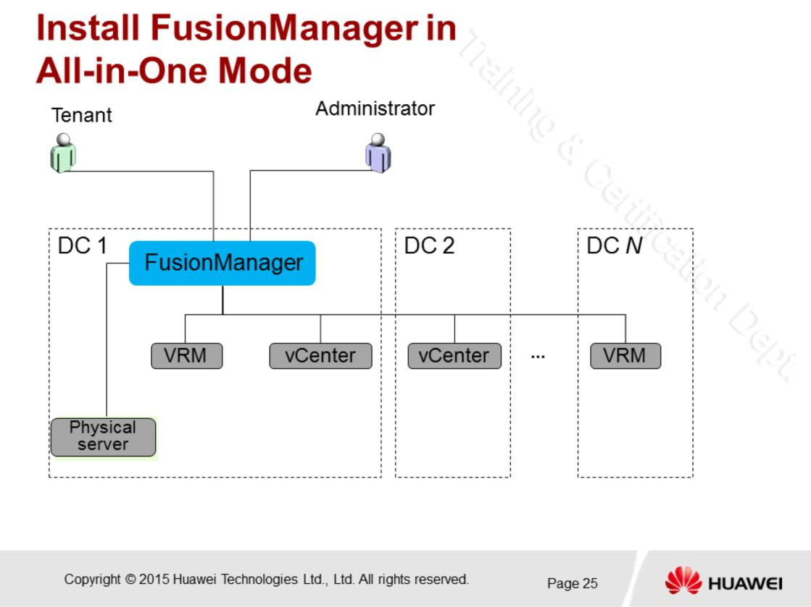
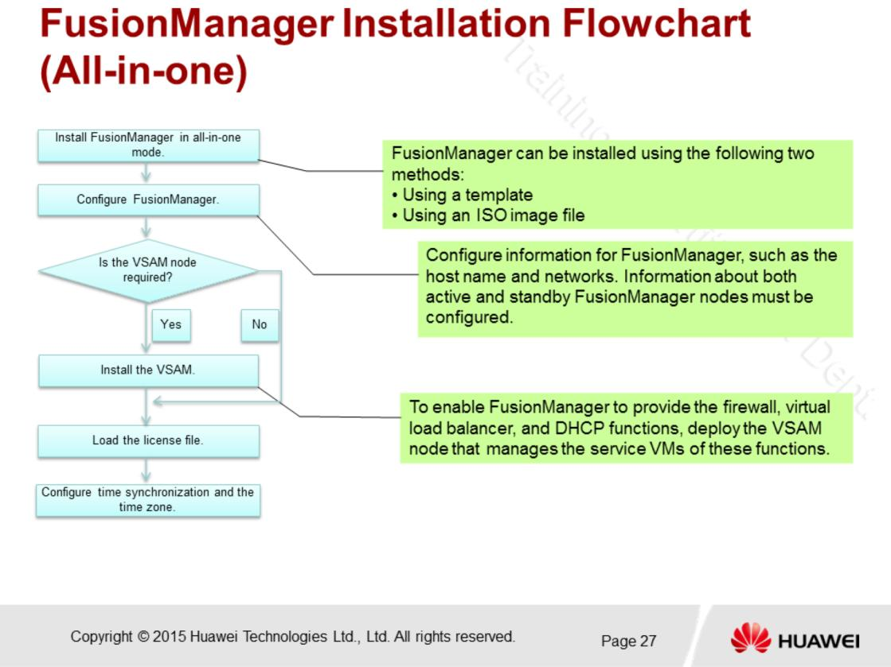
* FusionManager centrally manages resources in all DCs. Virtualization software deployed in DCs can be either Huawei FusionCompute or VMware vCenter.

* The FusionManager system connects to the business operation system and O&M system to implement functions of automatic application of resources or services and alarm reporting to the third-party O&M systems.

**Install FusionManager in Top-Local Mode**
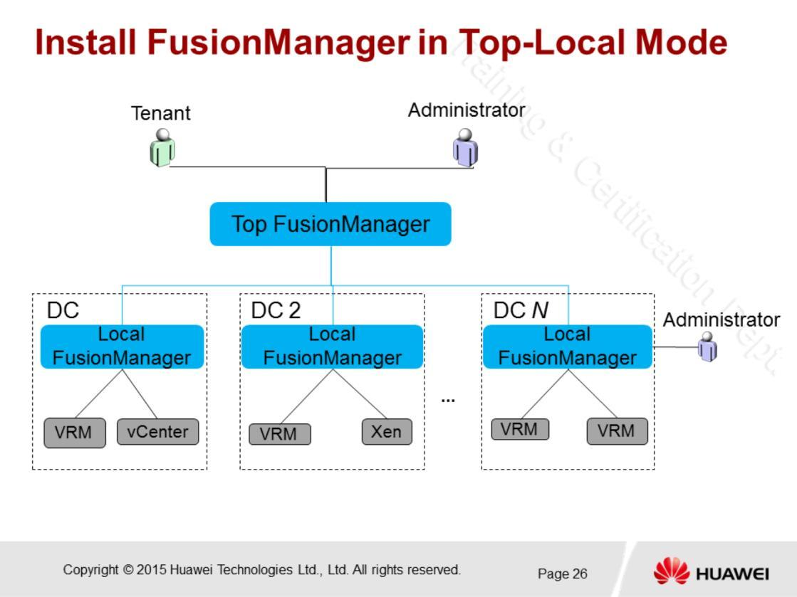
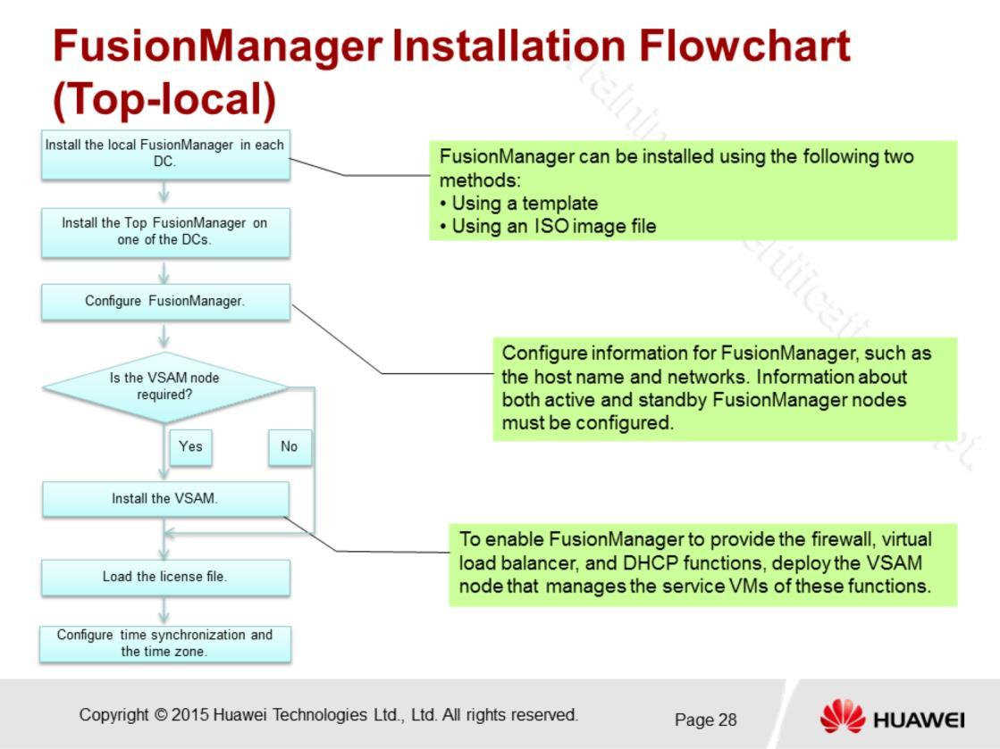
* Local FusionManagers manage resources from DC 1 to DC N. Local FusionManagers interwork with the top FusionManager using REST interfaces. The top FusionManager and local FusionManagers manage DC resources by role, respectively.
* Top FusionManager: It is deployed on a remote VM only in one DC and implements registration, deregistration, and cloud service management.
* Local FusionManagers: They are deployed on local VMs in each DC to add, configure, monitor, and maintain resources.
* The top FusionManager connects to the business operation system and automatically applies for resources or services. Both the local FusionManager and top FusionManager can connect to O&M systems to report alarms to third party O&M systems.
* The virtualization  software deployed in DCs can be either Huawei FusionCompute or VMware vCenter.

#### FusionAccess Installation
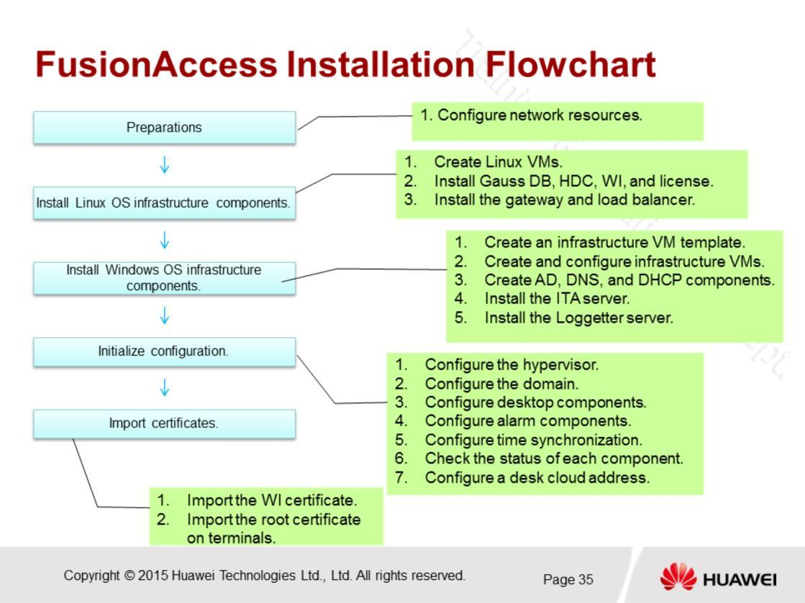

### Service Data Configuration
